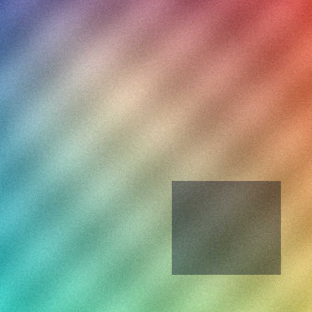

# OpenArtShield

> An experimental, honest toolkit for protecting visual work from unauthorized AI use - and measuring what actually holds up.

OpenArtShield is a TypeScript-first, open-source SDK and CLI for artists and
developers who want to **experiment with practical protection layers** against
unauthorized AI use of images: training, style mimicry, and scraping. Instead of
promising to make art "AI-proof", it does three things and is honest about all of
them: it **applies** real protection techniques (watermarking, embedding cloak),
it **measures** how they survive real-world handling, and it **reports** the
results so you can see what each technique actually does.

**OpenArtShield does not make images AI-proof.**

**It does not prevent AI training or guarantee protection from style mimicry.**

**Every result is experimental and meant to be measured, not trusted blindly.**

> **Status:** early/experimental (v0.1). I started this because most "protect your
> art from AI" tooling either overpromises or gives you no way to actually check
> whether it works. So this leans the other way: small, honest, and measurable.
> Expect rough edges and breaking changes between 0.x releases.

---

## Why this exists

Most "protect your art from AI" tooling sits at one of two extremes: vague
promises with no way to check them, or strong claims - "AI-proof", "blocks
training" - that don't survive scrutiny. OpenArtShield takes the opposite
approach: **measurable, reproducible, honest experiments.** The goal is a
practical SDK and research harness for **comparing protection layers** under
realistic conditions, so artists and developers can see what a technique actually
does instead of taking a marketing claim on faith.

---

## The protection layers

OpenArtShield models artist protection as a stack of independent, measurable
layers. Each is a separate concern with its own command; you can use one, some, or
all of them. None is a guarantee - the value is in being able to measure each one.

| Layer       | What it does                                                                               | Today                                      | Status           |
| ----------- | ------------------------------------------------------------------------------------------ | ------------------------------------------ | ---------------- |
| **Trace**   | Embed an invisible watermark + sidecar so you can later show a file is yours               | `oas embed` / `oas verify` / `oas protect` | ✅ working       |
| **Measure** | Quantify how a model "sees" an image via CLIP embedding drift                              | `oas ai-audit`                             | ✅ working       |
| **Cloak**   | Experimental perturbation that shifts model-facing embeddings while staying visually close | `oas cloak` (with EOT scoring)             | ✅ experimental  |
| **Audit**   | Run real-world transforms (JPEG, resize, crop, blur, screenshot) and report what survives  | `oas audit`                                | ✅ working       |
| **Declare** | Attach provenance / licensing intent (e.g. "no AI training")                               | -                                          | ⏳ future        |
| **Poison**  | Data-poisoning techniques against training pipelines                                       | -                                          | 🔬 research-only |

**Trace** and **Declare** make ownership and intent legible. **Cloak** and
**Poison** try to interfere with how models perceive or learn from an image.
**Measure** and **Audit** exist to tell you, with numbers, how well any of it is
actually holding up.

---

## What does it do?

The two working layers you can run end-to-end today are **Trace** (watermark) and
**Audit** (robustness). OpenArtShield embeds an invisible watermark, runs
realistic transformations, then reports whether the signal survived:

```
Original image -> Protected image -> Transform suite -> Extraction -> Metrics -> JSON/HTML report
```

## For developers

The research complexity - DCT coefficients, CLIP embeddings, EOT scoring - stays
behind small, composable commands and a pure TypeScript SDK. Today you compose the
layers explicitly:

```bash
# Trace + Audit in one shot: protected image + audit report + sidecar
oas protect artwork.png --message "artist=jane;license=no-ai-training" --out artwork.protected.png

# Verify the watermark later, straight from its sidecar
oas verify artwork.protected.png

# Cloak (experimental) + an independent embedding-drift measurement
oas cloak artwork.png --backend clip --eot standard --out artwork.cloaked.png --report cloak.json
oas ai-audit artwork.png artwork.cloaked.png --backend clip --out ai-audit.json
```

The direction is a single entry point where a developer passes one image and gets
back a **protected image, sidecar metadata, an audit report, an optional cloak
report, and a verification workflow** - without having to understand the research
underneath. `oas protect` is the first step toward that unified surface; the cloak
and declare layers are designed to fold in behind the same simple API.

## Example audit

| Original                                                      | Protected                                                       |
| ------------------------------------------------------------- | --------------------------------------------------------------- |
|  |  |

The protected image carries an invisible DCT-based watermark. The visual
difference should be minimal - the audit measures whether that signal survives
common transformations, not whether you can see it.

## Sample result

Real numbers from [`examples/reports/sample-audit.json`](examples/reports/sample-audit.json),
generated by the CLI on the 512x512 sample above (not hand-edited):

| Metric                 | Value |
| ---------------------- | ----: |
| Transformations tested |    14 |
| Successful recoveries  |     8 |
| Failed recoveries      |     6 |
| Recovery rate          | 57.1% |
| Average bit accuracy   | 95.4% |

This is intentionally not presented as a perfect result. The point of
OpenArtShield is to reveal where a protection signal survives and where it breaks.

| Transform             | Result     |
| --------------------- | ---------- |
| identity              | recovered  |
| jpeg_quality_95       | recovered  |
| jpeg_quality_85       | recovered  |
| jpeg_quality_70       | **failed** |
| resize_75             | **failed** |
| resize_50             | **failed** |
| center_crop_90        | **failed** |
| gaussian_blur_0_75    | recovered  |
| gaussian_blur_1_25    | **failed** |
| brightness_0_9        | recovered  |
| brightness_1_1        | recovered  |
| contrast_0_9          | recovered  |
| contrast_1_1          | recovered  |
| screenshot_simulation | **failed** |

See [`examples/README.md`](examples/README.md) for the full table (with PSNR/SSIM)
and how to reproduce it. An HTML version of this report is produced by
`oas audit --html`.

---

## What this project is

- A **composable SDK** for the protection layers above: invisible DCT watermarking, verify/sidecar, embedding cloak, and CLIP-based measurement.
- A **robustness harness** that applies deterministic image transformations and measures how well a protection signal survives them.
- A **reproducible audit tool** that produces machine-readable JSON (and HTML) reports.
- A clean, **TypeScript-first** monorepo with a pure core, a Node image-IO layer, and a CLI.

## What this project is _not_

- It is **not** a tool that prevents AI models from understanding, copying, or training on images.
- It does **not** reproduce Glaze, Nightshade, C2PA signing, diffusion-model attacks, or any published adversarial-perturbation system. The `ai-audit` (CLIP) and `cloak` layers are small, original, experimental measurements - not implementations of those papers.
- It does **not** guarantee that a watermark or cloak survives any particular transformation - measuring that is precisely the point.
- It makes **no security or legal guarantees**. A watermark is a signal, not a lock.

---

## Research context

OpenArtShield is inspired by research around robust watermarking, artist protection, adversarial perturbations, data poisoning, provenance metadata, and embedding-space evaluation.

The current v0.1 implementation is intentionally much smaller: a simple DCT-based invisible watermarking baseline plus a reproducible audit harness. The references below document the broader research context and possible future directions - they are **not** claims that these systems are implemented here. In fact, v0.1 implements **none** of them.

### Artist protection and adversarial perturbations

- **Glaze: Protecting Artists from Style Mimicry by Text-to-Image Models** - Shawn Shan, Jenna Cryan, Emily Wenger, Haitao Zheng, Rana Hanocka, Ben Y. Zhao. USENIX Security 2023. [arXiv:2302.04222](https://arxiv.org/abs/2302.04222) - [project page](https://glaze.cs.uchicago.edu/).
- **Nightshade: Prompt-Specific Poisoning Attacks on Text-to-Image Generative Models** - Shawn Shan, Wenxin Ding, Josephine Passananti, Stanley Wu, Haitao Zheng, Ben Y. Zhao. IEEE S&P 2024. [arXiv:2310.13828](https://arxiv.org/abs/2310.13828).
- **Adversarial Perturbations Cannot Reliably Protect Artists From Generative AI** - Robert Hönig, Javier Rando, Nicholas Carlini, Florian Tramèr. [arXiv:2406.12027](https://arxiv.org/abs/2406.12027).

### Classical and learned watermarking

- **Secure Spread Spectrum Watermarking for Multimedia** - I. J. Cox, J. Kilian, F. T. Leighton, T. Shamoon. IEEE Transactions on Image Processing, 1997. [doi:10.1109/83.650120](https://doi.org/10.1109/83.650120).
- **Robust Invisible Video Watermarking with Attention (RivaGAN)** - Kevin Alex Zhang, Lei Xu, Alfredo Cuesta-Infante, Kalyan Veeramachaneni. [arXiv:1909.01285](https://arxiv.org/abs/1909.01285).
- **Digital Watermarking for Image Authentication Based on Combined DCT, DWT and SVD Transformation** - Mohammad Ibrahim Khan, Md. Maklachur Rahman, Md. Iqbal Hasan Sarker (IJCSI, 2013).
- **Securing Medical Images by Watermarking Using DWT, DCT and SVD** - Nilesh Rathi, Ganga Holi.

### Provenance and semantic evaluation

- **C2PA Technical Specification / Content Credentials** - [c2pa.org/specifications](https://c2pa.org/specifications/) - [contentcredentials.org](https://contentcredentials.org/).
- **CLIP: Learning Transferable Visual Models From Natural Language Supervision** - Alec Radford et al. [arXiv:2103.00020](https://arxiv.org/abs/2103.00020).

This research informs OpenArtShield's _honest framing_: perturbation- and watermark-based protections are an arms race, and their value lies in being measured, not assumed. See the [roadmap](ROADMAP.md) for which of these directions might be explored in later versions.

---

## Installation

OpenArtShield is a pnpm monorepo. To work on it locally:

```bash
git clone https://github.com/jherediagu/open-art-shield.git
cd open-art-shield
pnpm install
pnpm build
```

The published packages (once released) will be installable individually:

```bash
# SDK only (pure, no image IO)
npm install @openartshield/core

# SDK + Node image IO and transforms
npm install @openartshield/node

# CLI
npm install -g @openartshield/cli
```

> The Node and CLI packages depend on [`sharp`](https://sharp.pixelplumbing.com/) for image decoding/encoding and transformations.

---

## CLI usage

The CLI binary is `oas`.

### Protect (recommended one-shot workflow)

`oas protect` is the high-level command: it checks capacity, embeds the watermark,
runs the audit, writes a JSON report, and writes a sidecar with the extraction
parameters - all in one step. It fails early (before writing anything) if the
message does not fit.

```bash
oas protect input.png \
  --message "artist=demo;license=no-ai-training" \
  --seed 123 \
  --strength 8 \
  --repetitions 5 \
  --out protected.png \
  --html report.html
```

```txt
OpenArtShield protect

Input: input.png
Output: protected.png
Message bytes: 34
Capacity: OK
Transforms tested: 14
Successful recoveries: 8
Failed recoveries: 6

JSON report: protected.audit.json
HTML report: report.html
Sidecar: protected.openartshield.json
```

By default it writes `protected.audit.json` (the report) and
`protected.openartshield.json` (the sidecar) next to the output image. Use
`--json`/`--sidecar` to override the paths, `--html` to also emit an HTML report,
`--skip-sidecar` to omit it, and `--store-message` to include the message in the
sidecar (off by default).

> The sidecar file stores the extraction parameters required to verify the
> watermark later (seed, message length, repetitions, strength). It does **not**
> store the original message by default.

### Verify

`oas verify` reads the sidecar and uses its parameters to extract and check the
watermark, so you don't have to remember the seed/length/repetitions by hand.

```bash
oas verify protected.png \
  --sidecar protected.openartshield.json
```

```txt
OpenArtShield verify

Image: protected.png
Algorithm: dct-basic
Checksum: valid
Recovered message: artist=demo;license=no-ai-training
```

If `--sidecar` is omitted it defaults to `<image-basename>.openartshield.json`.

### Embed a watermark

```bash
oas embed input.png \
  --message "artist=demo;license=no-ai-training" \
  --seed 123 \
  --strength 8 \
  --repetitions 5 \
  --out protected.png
```

### Extract a watermark

`--message-length` is the **UTF-8 byte length** of the original message.

```bash
oas extract protected.png \
  --seed 123 \
  --message-length 34 \
  --repetitions 5
```

### Audit robustness

Embeds the watermark, then runs the full transform suite and writes a JSON report
(add `--html report.html` for a standalone HTML version):

```bash
oas audit input.png \
  --message "artist=demo;license=no-ai-training" \
  --seed 123 \
  --strength 8 \
  --repetitions 5 \
  --out report.json \
  --html report.html
```

### Estimate capacity

The watermark stores one bit per 8x8 block, so capacity is `blocks / repetitions`.
Check whether a message fits before embedding:

```bash
oas capacity input.png \
  --message "artist=demo;license=no-ai-training" \
  --repetitions 5
```

```txt
Image: 384x384
Blocks: 2304
Message bytes: 34
Checksum bytes: 4
Payload bits: 304
Repetitions: 5
Required blocks: 1520
Available blocks: 2304
Capacity: OK
Max message bytes (at 5x repetitions): 53
```

### AI-perception audit (experimental)

`oas ai-audit` measures how a model's _embedding_ of an image changes between two
versions (e.g. original vs. protected), and whether that change survives the
transform suite. This is the first **AI-facing** measurement layer - the
groundwork for future cloaking work.

```bash
oas ai-audit original.png candidate.png \
  --prompt "an illustration in the artist's style" \
  --out ai-audit.json \
  --html ai-audit.html
```

There are two backends:

- **`mock`** (default) - a deterministic downsampled-luma feature, **not** a
  learned perceptual model. It exists so the pipeline can be built and tested
  without Python or model weights, and the CLI prints a warning when it is used.
- **`clip`** (experimental) - a real CLIP backend via
  [`transformers.js`](https://huggingface.co/docs/transformers.js) (ONNX, no
  Python). It is an **optional dependency** that is not installed by default:

  ```bash
  pnpm add @huggingface/transformers
  oas ai-audit original.png candidate.png --backend clip \
    --model Xenova/clip-vit-base-patch32 \
    --out ai-audit.json
  ```

  The first run downloads model weights from the Hugging Face hub and caches them
  locally - nothing is bundled or committed. If the dependency is missing, the
  command fails with a clear message. CI and the test suite always use the `mock`
  backend; the `clip` backend was verified to run locally but is experimental.

> **Caveats.** The `mock` backend does not represent how real AI systems see
> images. CLIP is only one proxy for image-text embedding behavior; it does not
> represent all diffusion models or training pipelines. Embedding drift is a
> measurement, not protection.

Telling detail: an _invisible_ DCT watermark produces near-zero embedding drift -
i.e. watermarking does **not** change how a model "sees" the image. That gap is
exactly what `oas cloak` (below) targets. (With the real `clip` backend, a
clearly different image drifts ~0.14 in our quick local check, while an image
against itself drifts 0 - sanity confirmed.)

### Experimental cloak

`oas cloak` is an experimental embedding-space perturbation prototype. It tries to
increase embedding drift under a selected backend while keeping visual quality
within configured thresholds (PSNR/SSIM). It is the first protection-facing
feature - but it is a measurement-driven experiment, not a guarantee.

**This is not AI-proof protection. It does not prevent training. It is not Glaze
or Nightshade.** It uses a simple seeded random search (a real optimizer is still
future work).

```bash
pnpm add @huggingface/transformers

oas cloak artwork.png \
  --backend clip \
  --model Xenova/clip-vit-base-patch32 \
  --strength 4 \
  --steps 12 \
  --eot standard \
  --out artwork.cloaked.png \
  --report artwork.cloak.json \
  --html artwork.cloak.html

# then measure the result independently
oas ai-audit artwork.png artwork.cloaked.png \
  --backend clip \
  --model Xenova/clip-vit-base-patch32 \
  --out artwork.ai-audit.json
```

#### EOT robustness (`--eot`)

By default each candidate is scored only on the clean image. With `--eot` the
score becomes the **average embedding drift across a set of deterministic
transformations** (Expectation Over Transformation), so the search prefers
perturbations that still move the embedding after everyday image handling -
JPEG re-compression, resize, blur, brightness/contrast, and a screenshot
simulation - instead of ones that only affect the pristine pixels.

| mode       | variants scored per candidate                                                                                     |
| ---------- | ----------------------------------------------------------------------------------------------------------------- |
| `none`     | clean only (default - same as before)                                                                             |
| `mild`     | clean, jpeg 95/85, brightness 0.9/1.1, gaussian blur 0.75                                                         |
| `standard` | clean, jpeg 95/85/70, resize 75%, brightness 0.9/1.1, contrast 0.9/1.1, gaussian blur 0.75, screenshot simulation |

Visual-quality guardrails (PSNR/SSIM) are unchanged: a candidate that fails the
limits is rejected **before** any EOT scoring, so EOT never trades visible
quality for robustness. The cloak report adds an `eot` block with the mode, the
transforms used, the chosen image's clean drift, the average and minimum EOT
drift, and the total number of embedding evaluations.

EOT makes the search more robust by scoring candidates through transformations,
but it still **gives no protection guarantees** - a higher averaged drift is a
measurement under the chosen backend and transforms, not protection from AI.

It only writes a cloaked image when a candidate actually improved drift within
the quality limits; otherwise it tells you so and writes nothing misleading. The
`mock` backend is the default for tests but is **not meaningful** for real
cloaking (the CLI warns you) - use `--backend clip`. If `@huggingface/transformers`
is not installed, the command fails with a clear message.

In a quick local run with the real `clip` backend, even this naive random search
moved CLIP drift from `0` to ~`0.09` at PSNR ~37 / SSIM ~0.97, and ~`0.07` of
that drift survived the transform suite.

> **Strong caveat.** A higher CLIP drift score does **not** mean the image is
> protected from all AI systems. It only means the selected embedding backend
> changed more under the measured conditions. Always evaluate the output with
> `oas ai-audit` and the robustness report, and treat everything as experimental.

### Print the version

```bash
oas version
```

Run `oas <command> --help` for the full option list.

---

## Try a real audit

The repository ships a complete, reproducible example under
[`examples/`](examples/README.md): a generated source image, its watermarked
version, and the JSON + HTML reports produced by the real CLI. After installing
dependencies you can regenerate all of it:

```bash
pnpm build
bash examples/commands/sample-audit.sh
```

That embeds a watermark into [`examples/images/sample-original.png`](examples/images/sample-original.png),
runs the full transform suite, and writes
[`examples/reports/sample-audit.json`](examples/reports/sample-audit.json) and a
standalone [`examples/reports/sample-audit.html`](examples/reports/sample-audit.html).

In that run the watermark survives light JPEG, brightness, contrast, and mild
blur, but **fails** under heavier compression, downscaling, cropping, and the
screenshot-style pipeline (8 / 14 transforms recovered). The honest mix is the
point - see [`examples/README.md`](examples/README.md) for the full table and how
to read it.

---

## Experimental cloak example

The repository also ships a complete, reproducible run of the **experimental**
cloak flow with a real CLIP backend and EOT robustness, under
[`examples/cloak-eot/`](examples/cloak-eot/README.md). The cloaked image carries a
visually-bounded perturbation that increases CLIP embedding drift; it should look
essentially identical to the original.

Position it correctly: this is an **experimental example of the Cloak and Measure
layers working together**, nothing more. It demonstrates that a near-invisible
perturbation can produce _measurable_ CLIP embedding drift. It does **not** prove
the image is protected, it does **not** prevent training, and it is **not** Glaze,
Nightshade, or AI-proof.

| Original                                            | Cloaked                                           |
| --------------------------------------------------- | ------------------------------------------------- |
|  |  |

Real numbers from
[`examples/cloak-eot/reports/cloak-eot-report.json`](examples/cloak-eot/reports/cloak-eot-report.json)
(`--backend clip --model Xenova/clip-vit-base-patch32 --strength 4 --steps 12 --eot standard`):

| Metric   | Value                          |     | Metric                      | Value  |
| -------- | ------------------------------ | --- | --------------------------- | ------ |
| Backend  | `Xenova/clip-vit-base-patch32` |     | Clean drift                 | 0.0735 |
| EOT mode | `standard` (11 variants)       |     | Average EOT drift           | 0.0680 |
| PSNR     | 40.73 dB                       |     | Minimum EOT drift           | 0.0416 |
| SSIM     | 0.9821                         |     | Mean drift after transforms | 0.0638 |

Reproduce it (the CLIP backend is an optional dependency, not required for CI):

```bash
pnpm build
pnpm add @huggingface/transformers
bash examples/cloak-eot/commands/run-cloak-eot.sh
```

> This is an **experimental embedding-space perturbation measured against CLIP**,
> not AI-proof protection. It does not prevent training and it is not Glaze,
> Nightshade, or C2PA. CLIP is only one proxy model - a higher drift score means
> the selected backend changed more under the measured conditions, nothing more.
> See [`examples/cloak-eot/README.md`](examples/cloak-eot/README.md) for the full
> tables, honest caveats, and how to read the minimum-drift floor.

---

## SDK usage

### Pure core (`@openartshield/core`)

```ts
import {
  embedWatermark,
  extractWatermark,
  type WatermarkConfig,
  type PixelImage,
} from "@openartshield/core";

const config: WatermarkConfig = {
  message: "artist=demo;license=no-ai-training",
  seed: 123,
  strength: 8,
  repetitions: 5,
};

// `image` is a raw PixelImage you supply (e.g. from @openartshield/node).
const { image: protectedImage } = embedWatermark(image, config);

const extraction = extractWatermark(protectedImage, {
  seed: 123,
  messageLength: config.message.length, // UTF-8 byte length
  repetitions: 5,
});

console.log(extraction.recoveredMessage); // "artist=demo;license=no-ai-training"
console.log(extraction.checksumValid); // true
```

### With Node image IO (`@openartshield/node`)

```ts
import { embedWatermark } from "@openartshield/core";
import { readImage, writeImage } from "@openartshield/node";

const image = await readImage("input.png");

const { image: protectedImage } = embedWatermark(image, {
  message: "artist=demo;license=no-ai-training",
  seed: 123,
  strength: 8,
  repetitions: 5,
});

await writeImage(protectedImage, "protected.png");
```

### Running an audit programmatically

```ts
import { readImage, embedAndAudit } from "@openartshield/node";
import { serializeReport } from "@openartshield/core";

const image = await readImage("input.png");
const { report } = await embedAndAudit(image, {
  message: "artist=demo;license=no-ai-training",
  seed: 123,
  strength: 8,
  repetitions: 5,
});

console.log(serializeReport(report));
```

---

## Example audit report

A report produced by `oas audit` on a 384x384 textured image (truncated for brevity). Note the honest mix of successes and failures - that is the signal this tool exists to surface.

```json
{
  "version": "0.1.0",
  "image": {
    "path": "input.png",
    "width": 384,
    "height": 384,
    "channels": 3
  },
  "watermark": {
    "expectedMessage": "artist=demo;license=no-ai-training",
    "seed": 123,
    "strength": 8,
    "repetitions": 5
  },
  "results": [
    {
      "transform": "identity",
      "recoveredMessage": "artist=demo;license=no-ai-training",
      "messageRecovered": true,
      "checksumValid": true,
      "bitAccuracy": 1,
      "psnr": null,
      "ssim": 1
    },
    {
      "transform": "jpeg_quality_85",
      "recoveredMessage": "artist=demo;license=no-ai-training",
      "messageRecovered": true,
      "checksumValid": true,
      "bitAccuracy": 0.99,
      "psnr": 41.7,
      "ssim": 0.99
    },
    {
      "transform": "resize_50",
      "recoveredMessage": null,
      "messageRecovered": false,
      "checksumValid": false,
      "bitAccuracy": 0.74,
      "psnr": 30.2,
      "ssim": 0.95
    }
  ],
  "summary": {
    "totalTransforms": 14,
    "successfulRecoveries": 8,
    "averageBitAccuracy": 0.94
  }
}
```

---

## Architecture

OpenArtShield separates **pure SDK logic** from **Node-specific image IO** and **CLI logic**:

```
@openartshield/core   ->  pure TypeScript: watermarking, payload, metrics, audit primitives
        ^
        | consumes
@openartshield/node   ->  sharp-based image IO + real-world transforms
        ^
        | consumes
@openartshield/cli    ->  the `oas` binary
```

- The **core** package has no filesystem access, no Node-specific APIs, and no `sharp` dependency. It operates on raw `PixelImage` data and is fully deterministic and testable in isolation.
- The **node** package converts image files to/from `PixelImage`, and implements deterministic transformation simulations.
- The **cli** package wires the two together behind a clean command-line interface.

### The watermark (v0.1)

A simple, readable DCT-based invisible watermark:

1. Convert RGB to a **luminance** plane (Rec. 601).
2. Split luminance into **8x8 blocks**.
3. Select blocks with a **deterministic seeded PRNG**.
4. Encode each bit by adjusting the **relative magnitude of two mid-frequency DCT coefficients**.
5. Decode by comparing those same coefficients.
6. Apply **repetition coding with majority vote** for basic error correction.
7. Include a **CRC-32 checksum** to detect corrupted extractions.

The payload pipeline:

```
message -> UTF-8 bytes -> + CRC-32 checksum -> bits -> repetition coding -> DCT embedding
```

and in reverse on extraction:

```
DCT coefficient comparison -> repeated bits -> majority vote -> bytes -> checksum validation -> message
```

> **Capacity note:** the watermark stores one payload bit per 8x8 block, so capacity is `blocks / repetitions`. A 34-byte message with a 4-byte checksum at 5x repetition needs 1,520 blocks (~312x312 px minimum). Larger images and shorter messages give comfortable headroom.

---

## Package overview

| Package                                | Description                                                                                                  |
| -------------------------------------- | ------------------------------------------------------------------------------------------------------------ |
| [`@openartshield/core`](packages/core) | Pure SDK: `PixelImage`, DCT, payload encoding, watermark embed/extract, PSNR/SSIM, audit primitives. No IO.  |
| [`@openartshield/node`](packages/node) | Node image IO (PNG/JPEG/WebP via `sharp`) and deterministic transform simulations.                           |
| [`@openartshield/cli`](packages/cli)   | The `oas` CLI: `protect`, `verify`, `embed`, `extract`, `audit`, `capacity`, `ai-audit`, `cloak`, `version`. |

### Built-in transforms

`jpeg_quality_95`, `jpeg_quality_85`, `jpeg_quality_70`, `resize_75`, `resize_50`, `center_crop_90`, `gaussian_blur_0_75`, `gaussian_blur_1_25`, `brightness_0_9`, `brightness_1_1`, `contrast_0_9`, `contrast_1_1`, `screenshot_simulation` (plus an automatic `identity` baseline).

---

## Current status

**Working today:**

- invisible watermarking (DCT);
- verify + sidecar metadata;
- robustness audits across real-world transforms;
- CLIP-based `ai-audit` (embedding drift between two images);
- experimental embedding cloak;
- EOT scoring (cloak robustness across transformations).

**Not solved (and not claimed):**

- guaranteed prevention of AI training;
- guaranteed protection from style mimicry;
- universal robustness across arbitrary pipelines and motivated adversaries;
- legal enforcement or proof of ownership on its own;
- provenance / C2PA;
- poisoning.

It is not yet a consumer-grade protection app for artists - the current focus is
measurement, reproducibility, and developer ergonomics. A watermark is a signal,
not a lock; a cloak is a measured perturbation, not a guarantee.

---

## Roadmap

The full, versioned plan lives in [`ROADMAP.md`](ROADMAP.md). In short:

- **v0.1** (current) - DCT watermarking, extraction, deterministic transform audits, PSNR/SSIM/bit-accuracy metrics, JSON reports, CLI, tests, CI.
- **v0.2** - reproducible examples and better reports (HTML report and example audits already landed; `oas capacity`, visual summaries next).
- **v0.3** - additional watermarking baselines behind a shared `WatermarkAlgorithm` interface (DWT/DCT, DWT/SVD, spread-spectrum).
- **v0.4** - provenance / C2PA experiments.
- **v0.5** - CLIP/OpenCLIP embedding-drift and semantic-robustness metrics.
- **v0.6** - adversarial perturbation baselines (Glaze/Mist-style), honestly measured.

See [`ROADMAP.md`](ROADMAP.md) for principles, non-goals, and research directions.

---

## Limitations

- The v0.1 watermark is a **classical, intentionally simple** DCT scheme. It is robust to mild JPEG and color changes but is **not** designed to survive heavy resizing, cropping, or aggressive re-encoding - and the audit will show you exactly where it breaks.
- Capacity is limited (one bit per 8x8 block before repetition coding).
- PSNR/SSIM are computed only when a transform preserves dimensions.
- Nothing here resists a motivated adversary, removal tools, or generative models. **It is a measurement tool, not a defense.**
- All results are experimental and depend heavily on image content, size, and parameters.

---

## Contributing

Contributions are welcome. To get started:

```bash
pnpm install
pnpm build
pnpm test
pnpm lint
pnpm typecheck
pnpm format:check
```

Please keep the core package pure (no filesystem or Node-specific APIs), add tests for new behavior, and run the full check suite before opening a pull request. Discussions about new watermarking baselines, transforms, and metrics are especially welcome - but please keep claims honest and grounded in measurement.

---

## License

[Apache-2.0](LICENSE) (c) OpenArtShield contributors.
